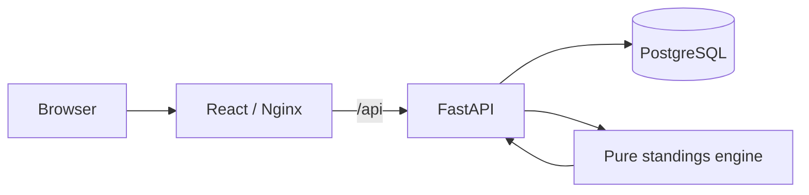

# LeagueLedger

**A cloud-ready football competition platform where results are the source of truth and standings are always derived from them.**

[](https://github.com/cssaritama/leagueledger/actions/workflows/ci.yml)
[](LICENSE)

**Portfolio release:** `v1.0.2`

LeagueLedger manages teams, match results and league standings through a small full-stack application built with React, FastAPI and SQLAlchemy. Its central design decision is deliberately simple: **the league table is never stored as independent state**. The system records match facts and recalculates standings from those facts on every read.

That makes the project useful beyond the UI itself. It demonstrates domain modeling, API design, automated testing, relational persistence, containerization, local Kubernetes deployment and CI in one repository that can be understood quickly.

## What it solves

Competition software often duplicates the same truth in multiple places: match results in one table and accumulated standings in another. Once those values drift, the system needs reconciliation logic to determine which one is correct.

LeagueLedger avoids that class of inconsistency by keeping a single authoritative record of what happened on the pitch and deriving the table from it.

## Core capabilities

- Register teams.
- Record completed matches.
- Delete an incorrect result and immediately restore a consistent table.
- Calculate points, wins, draws, losses, goals and goal difference.
- Apply deterministic tie-breakers.
- Expose a documented REST API.
- Run locally with SQLite or as a three-service stack with PostgreSQL.
- Deploy the application to a local Kubernetes cluster with `kind`.
- Validate the domain, API, PostgreSQL integration, frontend and container builds in CI.

## Architecture



The backend intentionally separates the domain rules from HTTP and persistence. `backend/app/standings.py` contains the league calculation as pure Python; it does not know FastAPI or SQLAlchemy exist.

See [Architecture](docs/architecture.md) and [Engineering decisions](docs/engineering-decisions.md) for the rationale and trade-offs.

## Technology stack

| Layer | Technology |
| --- | --- |
| Web | React 19, Vite, Nginx |
| API | Python 3.11+, FastAPI, Uvicorn |
| Domain | Pure Python standings engine |
| Persistence | SQLAlchemy 2 |
| Databases | SQLite for zero-config development, PostgreSQL for deployed environments |
| Testing | Pytest, FastAPI TestClient |
| Containers | Docker, Docker Compose |
| Orchestration | Kubernetes, kind |
| Automation | GitHub Actions, Dependabot, Ruff |

## Quick start with Docker

Requirements: Docker with the Compose plugin.

```bash
git clone https://github.com/cssaritama/leagueledger.git
cd leagueledger
docker compose up --build -d --wait
```

Open:

- Application: `http://localhost:8080`
- Interactive API docs: `http://localhost:8000/docs`

Verify the running stack:

```bash
./scripts/smoke-test.sh
```

Stop it with:

```bash
docker compose down
```

The Compose stack uses PostgreSQL and a named volume, so application data survives normal container restarts.

## Local development

### Backend

```bash
cd backend
uv sync
uv run uvicorn app.main:app --reload
```

The backend defaults to SQLite at `sqlite:///./leagueledger.db`, which keeps local development friction low.

### Frontend

```bash
cd frontend
cp .env.example .env
npm ci
npm run dev
```

The development UI runs at `http://localhost:5173` and talks to the API at `http://localhost:8000` by default.

## Quality checks

Run the local quality gate:

```bash
make test
```

This runs:

- backend linting with Ruff;
- domain and API tests with Pytest;
- frontend linting;
- production frontend build.

CI additionally starts a disposable PostgreSQL service and runs a real database integration flow before it builds both container images.

## Kubernetes demo

Requirements: Docker, `kind` and `kubectl`.

```bash
./scripts/kind-deploy.sh
```

Then expose the web service:

```bash
kubectl port-forward -n leagueledger service/frontend 8080:80
```

The local Kubernetes example demonstrates replicas, services, liveness/readiness probes, runtime secrets and persistent database storage. The repository does **not** pretend that its local `hostPath` PostgreSQL volume is a production architecture; a real deployment should use managed PostgreSQL and a production storage class.

See [Deployment guide](docs/deployment.md).

## API

Important endpoints:

| Method | Endpoint | Purpose |
| --- | --- | --- |
| `GET` | `/health` | Process liveness |
| `GET` | `/ready` | Database readiness |
| `GET` | `/teams` | List teams |
| `POST` | `/teams` | Register a team |
| `GET` | `/matches` | List recorded matches |
| `POST` | `/matches` | Record a result |
| `DELETE` | `/matches/{id}` | Remove an incorrect result |
| `GET` | `/standings` | Recompute and return the league table |

Examples are available in [API examples](docs/api-examples.md). The generated OpenAPI contract is committed as [`openapi.yaml`](openapi.yaml).

## League rules

- Win: 3 points.
- Draw: 1 point.
- Loss: 0 points.
- Tie-break order: points, goal difference, goals scored, team name.

The final alphabetical tie-break makes output deterministic even when teams are otherwise identical.

## Repository layout

```text
backend/
  app/
    config.py
    db.py
    main.py
    models.py
    schemas.py
    standings.py
  tests/
frontend/
k8s/
scripts/
docs/
.github/workflows/ci.yml
compose.yaml
Makefile
```

## Why this project is useful as a reference

LeagueLedger is intentionally not a collection of unrelated infrastructure tools. It shows one product evolving through a complete engineering path:

1. define a domain invariant;
2. isolate business rules;
3. expose them through an API;
4. build a usable web client;
5. persist facts in a relational database;
6. verify behavior at multiple layers;
7. package the system into containers;
8. orchestrate it in Kubernetes;
9. automate validation in CI.

That makes the repository small enough to review, while still showing how product and platform decisions connect.

## Roadmap

Potential product extensions, deliberately kept out of the current scope:

- seasons and competitions;
- player and squad data;
- richer historical analytics;
- authentication and role-based access;
- database migrations with Alembic;
- managed cloud deployment;
- observability for a hosted environment.

These are roadmap items rather than claimed capabilities.

## Documentation

- [Product vision](docs/product-vision.md)
- [Product specification](docs/product-spec.md)
- [Architecture](docs/architecture.md)
- [Engineering decisions](docs/engineering-decisions.md)
- [API examples](docs/api-examples.md)
- [Deployment guide](docs/deployment.md)
- [Demo guide](docs/demo-guide.md)
- [Maintenance](docs/maintenance.md)
- [Contributing](CONTRIBUTING.md)
- [Security](SECURITY.md)
- [Changelog](CHANGELOG.md)

## License

MIT. See [LICENSE](LICENSE).
