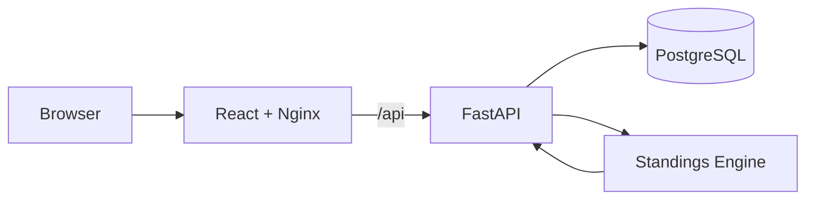

# Architecture

LeagueLedger is intentionally small, but its boundaries are explicit.

## Application boundaries

### Frontend

The React client renders teams, results and standings. Network access is
centralized in `frontend/src/api/client.js` so UI components stay independent
from transport details.

### API

FastAPI owns validation, persistence orchestration and HTTP semantics. The API
never stores a league table.

### Domain engine

`backend/app/standings.py` is a pure function layer. Given teams and match
results, it computes a deterministic table. It has no FastAPI or SQLAlchemy
dependency and is tested independently.

### Persistence

SQLAlchemy isolates the application from the database engine. SQLite is the
zero-configuration development default; PostgreSQL is used by Docker Compose,
the integration test and the Kubernetes deployment.

## Runtime topology

The containerized stack has three services:

1. `frontend` - static React build served by Nginx.
2. `backend` - FastAPI/Uvicorn API.
3. `postgres` - PostgreSQL with persistent storage.

The web container proxies `/api/*` to the backend, so the browser has one
origin when the stack runs through Docker or Kubernetes.

## Kubernetes

The local `kind` deployment uses:

- two frontend replicas;
- a one-shot schema initialization Job;
- two backend replicas;
- one PostgreSQL replica;
- readiness and liveness probes;
- a Kubernetes Secret created at deployment time;
- persistent local storage for PostgreSQL.

The database manifest is intentionally local-development infrastructure. A
production deployment should use managed PostgreSQL and a production storage
class rather than the included `hostPath` volume.
